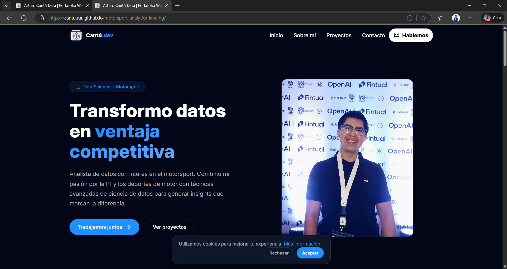

# motorsport-analytics-landing

Portafolio  enfocado en Data Science y Motorsport. Sitio creado con HTML, CSS y JavaScript (sin framework), pensado para desplegar en GitHub Pages.

Imagen del sitio:

## Despliegue
El sitio está desplegado en GitHub Pages y se puede ver en:
`https://cantuuuu.github.io/motorsport-analytics-landing/`

## Características
- Diseño responsive y oscuro.
- Navbar con menú móvil.
- Secciones: Hero, Problemas, Solución, Proyectos, FAQ y Contacto.
- Banner de cookies y menú accesible.

## Tecnologías
- HTML5
- CSS (archivo principal: `src/css/styles.css`)
- JavaScript (interacciones: `src/js/main.js`)
- Imágenes/SVG en `src/img/`

## Estructura del proyecto
```
`motorsport-analytics-landing/`  
├── `index.html`                 # Página principal del sitio  
├── `README.md`                  # Este archivo  
├── `EVIDENCIAS.md`              # Capturas y aprendizajes  
└── `src/`                       # Carpeta de recursos  
    ├── `css/`  
    │   └── `styles.css`         # Estilos globales del sitio  
    ├── `img/`  
    │   ├── `hero.png`           # Imágenes generales / ejemplos  
    │   ├── `logo.svg`           # Logo principal  
    │   └── `icons8-ciencia-de-datos.svg` # Favicon (SVG)  
    └── `js/`  
    └── `main.js`            # Interacciones (menu, cookies, smooth scroll)
```
## Licencia
Ver archivo `LICENSE`.

## Contacto
- Email: cantu1306@gmail.com
- GitHub: `https://github.com/Cantuuuu`

---

## Límites y próximos pasos

Límites actuales:
- Sitio estático sin backend ni formularios funcionales (el formulario usa `action="#"`).
- Falta de tests automatizados y pipeline CI/CD para despliegues.
- Algunas optimizaciones de performance pendientes (optimizar imágenes, lazy loading avanzado, WebP).
- Mejora de accesibilidad a niveles avanzados (lectores de pantalla, pruebas con Lighthouse).

Próximos pasos recomendados:
1. Hacer el formulario funcional con un endpoint o integración (Netlify Forms, Formspree, o backend propio).
2. Optimizar imágenes y generar múltiples tamaños / WebP para mejorar performance.
3. Añadir CI/CD con GitHub Actions para deploy automático a GitHub Pages.
4. Implementar comprobaciones automáticas: lint, tests básicos y audit de accesibilidad (Lighthouse).
5. Convertir en PWA (manifest + service worker) para instalar y mejorar experiencia móvil.
6. Añadir tests visuales (percy/Chromatic) o pruebas E2E si se integra lógica más compleja.