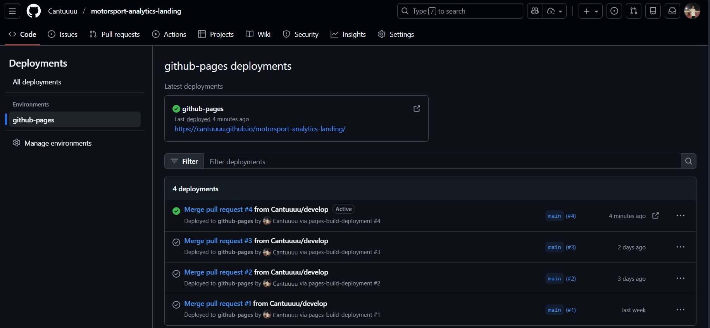
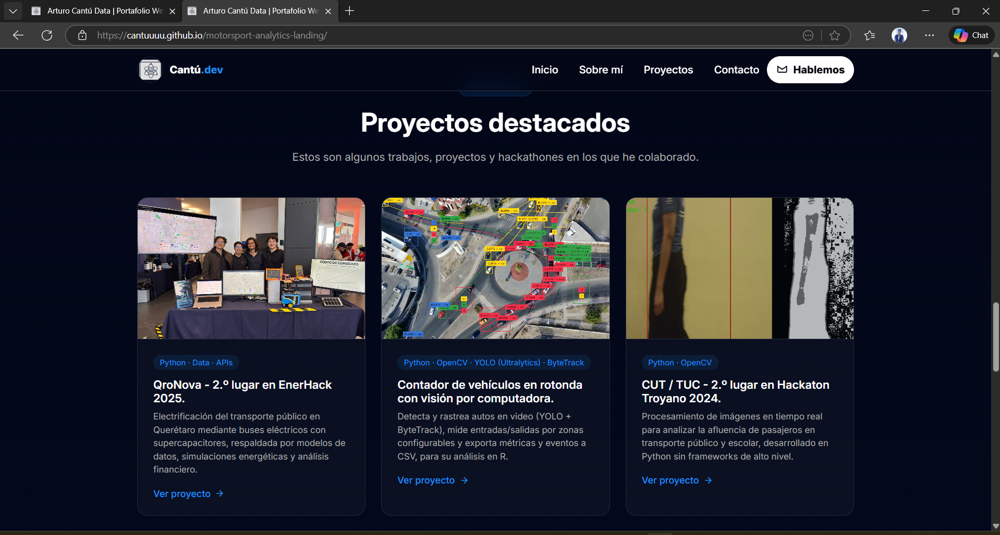

# EVIDENCIAS

## 1) Settings → Pages (URL activa)
- Captura que muestra la URL activa en GitHub Pages.
- Archivo de la imagen: `src/img/githubPages.png`

---

## 2) Capturas del sitio en el navegador
- Vista principal (hero). Archivo: `src/img/hero.png`  
  

- Vista de la sección de proyectos. Archivo: `src/img/proyectos.png`  
  

---

## 3) Aprendizajes

1. ¿Qué fue lo más fácil y lo más retador?
    - Fácil: Estructurar la maquetación básica y aplicar estilos globales.
    - Retador: Alinear elementos responsive y asegurar consistencia de imágenes de diferentes tamaños.

2. ¿Qué etiquetas semánticas usaste y por qué?
    - `header`, `nav`, `main`, `section`, `article`, `footer`, `details` / `summary`.
    - Motivo: mejorar accesibilidad, estructura lógica del documento y SEO.

3. ¿Cómo organizaste tus commits?
    - Commits pequeños y atómicos con mensajes descriptivos tipo `feat: agregar seccion FAQ`, `fix: corregir alineación logo`, etc.
    - Uso de rama develop para desarrollo y main para producción.

4. ¿Qué mejorarías en la siguiente iteración?
    - Optimizar imágenes (WebP, tamaños responsive), mejorar accesibilidad (contrastes, ARIA), añadir pruebas visuales y pipeline CI/CD para deploy automático.
